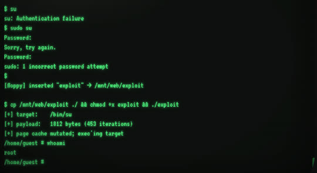

## Pokapoka栏目统一警告
本栏目所有文章仅供安全研究与技术交流，漏洞已反馈或测试仅限于本人授权范围内的设备。
使用的机器为本人编译本地运行的虚拟机，所有渗透测试均在隔离网络中进行。

## 前情提要
NCC做了一个非常好看的主页！ [在这里就能看](https://nancunchild.me)
从整体风格确定，JS 实现 3D 字符动画和 v86 ，以及 JS 硬写伪终端，到最终落地部署无问题共花费7天！感谢Claude帮助写了最麻烦，最多if分支的伪终端以及3D字符动画的阴影处理，不然可能得写一个多月。

NCC做网页的时候想到，LLM越来越会写网页了，而且刚开始写代码时最擅长的就是前端。那如何把一个网页做得有个人风格，做得硬核一点，做得独特一点呢？于是NCC想到了一个古早时期收藏的项目：v86 。

> v86是一个基于Javascript实现的虚拟硬件方式（有点强），能让Linux内核在前端跑起来，从而能实现无服务器前端实现一个可以交互的Linux虚拟机。而且v86开发者还做出了有头模式，甚至支持Windows2000 。[ 项目地址](https://copy.sh/v86/) 

NCC想的是网页的一个 section 放一个伪终端，通过这个伪终端可以启动 v86 真内核。有了一个伪终端和Linux真终端能干嘛呢？ 伪终端可以放预设指令来展示 CLI 版本的网页，听起来就很帅；同时伪终端还能做个简单的提权，做成 CTF 风格的彩蛋。 真终端也可以这么做。

其实当时想到 v86 之后，想法就是干脆不要伪终端，直接启动就是真终端，然后给内核编译额外的输出串口用来和网页 JS 通信来改变网页行为。但是当时不知道这个性能压力和内存压力会不会太大，一启动就占人家网页内存似乎不太好，于是就改为了目前的二级启动模式。如今发现性能压力还可以，可以考虑要不要删掉伪终端。毕竟伪终端功能实现太复杂，功能又和真终端重叠，而且总是会有奇奇怪怪的bug 。

顺便提一下，截至2026年5月28日，伪终端的提权方式有三种。对于只想看一下彩蛋的朋友们，root密码是1433 。

接下来准备讲的主题是 v86 虚拟机镜像的选型和编译。

## Linux内核编译
首先我们得分清楚， v86 只是一个虚拟化硬件层，是和 VMWare 一级的东西，并不是指 Linux 内核或者是 CPU 架构。

所以编译这个与普通Linux编译别无二致，只是需要注意性能表现和g镜像大小，太担心别人的浏览器卡死了。

既然要选择最小的Linux ，那也就扔掉那些主要发行版了。我们直接源头编译，选择 `buildroot` 项目，同时把文件系统做成 squashfs 。

```shell
wget https://buildroot.org/downloads/buildroot-2026.02.1.tar.gz
tar xvzf buildroot-2026.02.1.tar.gz
cd xvzf buildroot-2026.02.1
```

构建所需的核心没问题了，接下来为了配置方便，可以直接拿模板：

```shell
git clone https://github.com/Darin755/browser-buildroot.git
```

我的配置是直接将模板放置在 `board/browser-linux` 下，并且修改 `build.sh` 复制配置，记住需要编译 `i686` 对象。

```shell
./build.sh linux-reconfigure all
```

如果要自己慢慢配置，可以到根目录选择：

```shell
make menuconfig
```

根据上述跑出来的构建镜像是最新内核，默认的内容。我想尝试的 copyfail 漏洞需要旧一点都内核版本，大版本确定是 6.x ，但是编译太老的过程中出现一点问题。而且需要编译 `AL_ALG` 地址族才能开始考虑利用。如果不做任何配置，那就是一个结论：“太过简单，以至于没有漏洞”

### AF_ALG 地址族补齐

在 `linux.conf` 中添加如下配置项：

```conf
 CONFIG_CRYPTO_USER_API=y  
 CONFIG_CRYPTO_USER_API_HASH=y  
 CONFIG_CRYPTO_USER_API_SKCIPHER=y  
 CONFIG_CRYPTO_USER_API_AEAD=y  
 CONFIG_CRYPTO_USER_API_RNG=y
```

清除缓存，复制配置项，重新编译之后，检查 `System.map` ，如果出现了 `af_alg` 符号，说明 `AF_ALG` 模块已经被成功编译进入内核。而且加入这几个配置项之后，内核几乎没有大小，因为加密方式库已经在内核中，这几项的作用在于从内核引出可以操作的接口。

### 版本调整

一开始考虑的是版本越老越好，但是Linux内核属于无视底层开发者痛楚经常大改的东西，在尝试编译 `6.6.6` 版本时直接报错。我使用的主机 `ArchLinux 7.0.9-arch1-1` 里面的各种工具链太新。使用的工具链：`GCC 15.2.0 + binutils 2.44 + musl（i686）` 
编译失败之后又去找资料，结果发现是已知问题，官方不准备修：
- GCC 14/15 已经把 -Wincompatible-pointer-types、-Wimplicit-function-declaration 升级成默认错误
- GCC 14/15 将多个惯用的单词设置为了关键字，以前的那种 `false=0` 用不了了
一开始以为只有第一个问题，于是使用封印符镇压errors，在 `deconfig` 中添加这个就可以把错误降级为可以允许通过的警告：
```
BR2_LINUX_KERNEL_EXTRA_OPTS="KCFLAGS=-Wno-error=incompatible-pointer-types -Wno-error=implicit-function-declaration"
``` 

结果只让构建过程多撑了3秒不到，撞到了上述提到的第二个问题。

最终查阅资料之后放弃直接编译这个版本，按道理说其实用docker再学一下老GCC语法也能解决这个问题，但是NCC拒绝因为要编译老头内核而变成GCC开发者去坐牢。

最终选择版本为 `6.12.12` 在过程中一路报错，但是只要哪里报错就关掉哪里的功能，比如出现了一个奇怪的EFI报错，还是上面提到的第二个问题：

```txt
  include/linux/stddef.h:11:9: 错误：cannot use keyword 'false' as enumeration constant
  'false' is a keyword with '-std=c23' onwards
  include/linux/types.h:35:33: 错误：'bool' cannot be defined via 'typedef'
  'bool' is a keyword with '-std=c23' onwards
```

烦人，才不要一个个改源码，直接砍掉EFI功能，反正只在浏览器里面运行，只给 SeaBIOS 就足够了：

```conf
# EFI / UEFI: v86 boots via SeaBIOS legacy, EFI is dead code here.
# Also avoids the GCC 15 vs old efi/libstub C23-keyword build error
# (true/false/bool became keywords; libstub doesn't pass -std=gnu11).
# CONFIG_EFI is not set        
```

一路遇到问题就关掉功能，结果最后踢到铁板了。

错误移到 arch/x86/boot/compressed/string.o 等文件，也是同一个 C23 关键字问题，只是这次是 `bzImage` 解压器 的子 Makefile。它和 `EFI libstub` 一样都用 `KBUILD_CFLAGS := ...` 硬重置（而不是追加 +=），把主 Makefile 设的 -std=gnu11 给冲掉。GCC 15 默认 C23，于是匆匆爆。

这个功能没法移除，这是镜像启动必需的解压器，也没法自己手写解压过程。

到这里有点绝望了，搜到的资料比较少，但是奇妙的克劳德告诉我可以尝试打一个 `build-only` 补丁，往两处子 Makefile（`arch/x86/boot/compressed/` 和 `drivers/firmware/efi/libstub/`）追加 `-std=gnu11`。这是纯构建修复，不会影响内核功能。其实再问克劳德，他也不确定行不行，不知道会不会又有奇妙代码给我的配置冲刷掉。但是尝试了一下

给 `arch/x86/Makefile` 的 `REALMODE_CFLAGS :=` 字段补上 `-std-gnull` 标签
给 `arch/x86/boot/compressed/Makefile` 对应字段也补上标签

哇，成功了。版本越新，问题越少。版本越老，邪修越多。

### 加上限制

目前进入系统就是root, 这还玩什么，赶快把root禁用掉：
- `/etc/passwd` 中设置root的密码哈希为 `*` ，GUI构建中的“禁止root密码登录”就是用的这个原理
- 把root登录shell指向nologin ，busybox里面没有自带这个，理论上指向 `/dev/null` 也可以，但是可能会卡住，所以就手写一个简单的nologin，任务就是 `exit 1` ，使用覆盖文件根覆盖到`/sbin/nologin` 然后指向它。
- 还有一个想法，是把`sudo`和`su`的SUID位挤掉，但是我担心这样可能真没法利用了，所以先写好注释起来，需要再启用。

如下是完整的 `post-fakeroot.sh` 内容，这个markdown代码识别似乎有问题，把写入 `nologin` 的内容连带后面的代码一起弄变色了。

```bash
#!/bin/sh  
# board/browser_linux/post-fakeroot.sh  
#  
# Runs in fakeroot context AFTER target-finalize (which wipes  
# $(TARGET_DIR)/usr/include and all .a files), and just before the  
# squashfs image is built. We use it to:  
#  
#   1. Lock root.  
#   2. Seed the squashfs with tcc's libtcc1.a runtime, the musl headers  
#      and crt objects, so `tcc -o foo foo.c` works inside the VM.  
#  
# Variables provided by buildroot:  
#   $1  = path to the staging tree being squashed (squashfs target dir)  
#   The environment also exports BUILD_DIR, HOST_DIR, etc.  
  
set -eu  
  
TARGET_DIR="${1:-${TARGET_DIR:-}}"  
if [ -z "${TARGET_DIR}" ] || [ ! -d "${TARGET_DIR}" ]; then  
   echo "post-fakeroot.sh: TARGET_DIR not set or not a directory" >&2  
   exit 1  
fi  
  
# BUILD_DIR and HOST_DIR are set by Buildroot when invoking us.  
: "${BUILD_DIR:?BUILD_DIR not exported by buildroot}"  
: "${HOST_DIR:?HOST_DIR not exported by buildroot}"  
  
STAGING_DIR="${HOST_DIR}/i686-buildroot-linux-musl/sysroot"  
TCC_BUILD_DIR="${BUILD_DIR}/tcc-0.9.27"  
  
# ----------------------------------------------------------------------  
# 1. Lock root account.  
# ----------------------------------------------------------------------  
  
# Provide /sbin/nologin (busybox doesn't ship one).  
if [ ! -x "${TARGET_DIR}/sbin/nologin" ]; then  
   mkdir -p "${TARGET_DIR}/sbin"  
   cat > "${TARGET_DIR}/sbin/nologin" <<'EOF'  
#!/bin/sh  
echo "This account is not available."  
exit 1  
EOF  
   chmod 0755 "${TARGET_DIR}/sbin/nologin"  
       fi  
  
# Force root's shell to /sbin/nologin (sed handles both 7- and 8-field forms).  
#sed -i -E 's|^(root:[^:]*:0:0:[^:]*:[^:]*):[^:]*$|\1:/sbin/nologin|' \  
#    "${TARGET_DIR}/etc/passwd"  
  
# Force root's shadow hash to "*".  
#sed -i -E 's|^root:[^:]*:|root:*:|' "${TARGET_DIR}/etc/shadow"  
  
# Empty /etc/securetty.  
#: > "${TARGET_DIR}/etc/securetty"  
#chmod 0600 "${TARGET_DIR}/etc/securetty"  
  
# Pre-create directories that need correct ownership at first boot  
# (tmpfs will be mounted on top of /home/guest at runtime, but the  
# squashfs anchor has to look right for the fraction of a second  
# before mount).  
mkdir -p "${TARGET_DIR}/home/guest"  
chown 1000:1000 "${TARGET_DIR}/home/guest"  
chmod 0700 "${TARGET_DIR}/home/guest"  
  
mkdir -p "${TARGET_DIR}/mnt/web"  
  
# ----------------------------------------------------------------------  
# 2. Seed TCC runtime + system headers + crt.  
#    Without these, `tcc hello.c` fails with `stdio.h: No such file`.  
# ----------------------------------------------------------------------  
  
if [ -d "${TCC_BUILD_DIR}" ]; then  
   # libtcc1.a (TCC's helper functions: __divdi3, alloca, etc.)  
   if [ -f "${TCC_BUILD_DIR}/libtcc1.a" ]; then  
       install -D -m 0644 "${TCC_BUILD_DIR}/libtcc1.a" \  
           "${TARGET_DIR}/usr/lib/tcc/libtcc1.a"  
   fi  
   # tcc's own private headers (stdarg.h, stddef.h, …).  
   if [ -d "${TCC_BUILD_DIR}/include" ]; then  
       mkdir -p "${TARGET_DIR}/usr/lib/tcc/include"  
       cp -dR "${TCC_BUILD_DIR}/include/." "${TARGET_DIR}/usr/lib/tcc/include/"  
   fi  
fi  
  
# musl headers — strip out the kernel/internal ones that tcc shouldn't see.  
if [ -d "${STAGING_DIR}/usr/include" ]; then  
   mkdir -p "${TARGET_DIR}/usr/include"  
   cp -dR "${STAGING_DIR}/usr/include/." "${TARGET_DIR}/usr/include/"  
fi  
  
# crt objects (start files) for linking. musl keeps them in /lib.  
mkdir -p "${TARGET_DIR}/usr/lib"  
for f in crt1.o crti.o crtn.o Scrt1.o rcrt1.o gcrt1.o; do  
   for src in "${STAGING_DIR}/lib/$f" "${STAGING_DIR}/usr/lib/$f"; do  
       if [ -f "$src" ]; then  
           install -m 0644 "$src" "${TARGET_DIR}/usr/lib/$f"  
           break  
       fi  
   done  
done  
  
# Static libc + helpers, also typically in /lib for musl.  
for f in libc.a libdl.a libm.a libpthread.a; do  
   for src in "${STAGING_DIR}/lib/$f" "${STAGING_DIR}/usr/lib/$f"; do  
       if [ -f "$src" ]; then  
           install -m 0644 "$src" "${TARGET_DIR}/usr/lib/$f"  
           break  
       fi  
   done  
done  
  
echo "post-fakeroot.sh: root locked, TCC runtime + headers + crt seeded"  
  
# ----------------------------------------------------------------------  
# 3. Replace /bin/su (busybox symlink) with a standalone setuid binary.  
#  
# Reason: a page-cache injection exploit targeting /bin/su would, via  
# the symlink, end up mutating /bin/busybox's page cache, breaking  
# every command on the system AND not even elevating (busybox isn't  
# setuid). With a separate binary at its own inode we get:  
#   * independent page cache (mutation doesn't touch busybox)  
#   * setuid root (mutated code in cache runs as uid 0)  
# ----------------------------------------------------------------------  
  
# This code... I will explain it later
SU_SRC="$(dirname "$0")/su.c"  
CROSS_GCC="${HOST_DIR}/bin/i686-buildroot-linux-musl-gcc"  
  
if [ -f "${SU_SRC}" ] && [ -x "${CROSS_GCC}" ]; then  
   SU_OUT="${BUILD_DIR}/browser_linux-su"  
   "${CROSS_GCC}" -static -Os -s -o "${SU_OUT}" "${SU_SRC}"  
  
   # Drop the busybox symlink and install our binary in its place.  
   rm -f "${TARGET_DIR}/bin/su"  
   install -D -m 4755 -o 0 -g 0 "${SU_OUT}" "${TARGET_DIR}/bin/su"  
  
   echo "post-fakeroot.sh: installed standalone /bin/su (mode 4755, root:root)"  
else  
   echo "post-fakeroot.sh: WARN: skipping /bin/su replacement (missing su.c or cross-gcc)" >&2  
fi  
  
# ----------------------------------------------------------------------  
# 3. Disable privilege escalation: strip setuid from sudo and busybox.  
#  
# Effect:  
#   * sudo will refuse ("/usr/bin/sudo must be owned by uid 0 and have the  
#     setuid bit set") at startup, BEFORE prompting for a password.  
#   * busybox without setuid means /bin/su called by guest can't read  
#     /etc/shadow and bails the same way; no password prompt either.  
#   * login-flow is unaffected: getty already runs as root (init child),  
#     so its `su -l guest` is a demotion, which doesn't need setuid.  
# ----------------------------------------------------------------------  
#if [ -x "${TARGET_DIR}/bin/busybox" ]; then  
#    chmod 0755 "${TARGET_DIR}/bin/busybox"  
#fi  
#if [ -x "${TARGET_DIR}/usr/bin/sudo" ]; then  
#    chmod 0755 "${TARGET_DIR}/usr/bin/sudo"  
#fi  
  
#echo "post-fakeroot.sh: setuid bits stripped from busybox and sudo"
```

清除缓存，重新复制配置之后编译，一切都完成了。

### 节外生枝

利用的时候发现卡死了：

```txt
cp /mnt/web/exploit ./                                                           
  $ chmod +x exploit                                                             
  $ ./exploit                                                                    
  [+] target:    /bin/su                                                        
  [+] payload:   1812 bytes (453 iterations)                                     
  [+] page cache mutated; exec'ing target                                        
  whoami                                                                         
  ^C                                                                             
  $ cd /etc/                                                                     
  $ ls                                                                           
  ^C                                                                             
  $ whoami                                                                       
  ^C                                                                             
  $  
```

利用之后，发现整个崩溃了，几乎所有指令都会坏掉挂起，只有少数的如 `cd` 指令不受影响。根据 copyfail 的机制，应该是写内存页写坏了，但是按道理说也只会写坏 `su` 程序的内存页，全坏了是什么意思？

根据终端对不同命令的表现，有一个合理的猜想：
exploit 的 "page cache mutated" 信息真发生了（根据CVE-2026-31431的适用范围，这个 LPE 在 6.12.12 上确实可用），但它把 `/bin/su` 的 page cache 篡改了。而在 busybox 系统里几乎所有程序是 busybox 本身的 symlink/applet，`/bin/su` 应该也不例外 。结果是 busybox 的 page cache 被毁，可以说 busybox 本身在覆盖时瞬爆，之后任何 exec 一个 busybox 程序（ls/whoami/cat...）都读到坏代码直接卡死。当前正在跑的那个 shell 是已经加载到内存的 busybox 实例，所以它还在苟延残喘，还能勉强打印 `$` 提示符；但 ls 这种需要 fork+exec 新 busybox 进程的，就读到被污染的 page cache，挂掉。`cd /etc/` 是 shell builtin、不需要 exec，所以表面成功了。
  
根本原因就是：
exploit 调 execve("/bin/su") → 内核 follow symlink → 真正打开/读的是 /bin/busybox 的 inode
exploit找到 busybox 之后发现这玩意正好也有 `setuid` 位，直接注入，整个缓存页全坏了，这个缓存页正好又是众多 busybox 命令的出生点。
所以说，好消息：exploit成功了 ； 坏消息：太彻底导致系统炸了

目前想到的办法就是抛弃 busybox 自带的这个 su ，选择另外的。一开始挑选的是 `util-linux` 本身比较完美，但是在编译阶段发现它强制依赖 `linux-PAM`，PAM 又不支持 musl ，如果要用它还得装巨无霸 `glibc` ，镜像大小直接爆炸。于是直接手写比较好，inode 也独立，自己也有 `setuid root` 。为什么不能从 `coreutils` 中拿一个呢？因为GNU coreutils 的 su.c 不是一个能独立编译的源文件，它只是 `coreutils` 包内众多源文件中的一个，必须要在 `coreutils` 的整套构建系统里才能编译。而引入完整的 PAM 反而对于这种为了最小化的镜像并不优雅，于是手写一个功能一样的即可，毕竟 `setuid(0)` 又不是什么难事。

自己手敲还遇到一件事：写得太心急，忘记判定身份了。写了 `if (setgid(0) != 0 || setuid(0) != 0)` ，会导致无视调用者给root，也没指定身份。特别是一开始图方便写的 `/sbin/login-guest` 直接调用 su 尝试进行用户转换，用自己写的版本直接全员root 。

```c
#include <unistd.h>  
#include <stdio.h>  

int main(void)  
{  
   if (setgid(0) != 0 || setuid(0) != 0) {  
       perror("setuid/setgid");  
       return 1;  
   }  
  
   char *argv[] = { "sh", NULL };  
   char *envp[] = { "PATH=/bin:/sbin:/usr/bin:/usr/sbin", NULL };  
   execve("/bin/sh", argv, envp);  
  
   perror("execve /bin/sh");  
   return 1;  
}
```

然后按照之前贴出来的 `post-fakeroot.sh` 写出来，就能顺利构建完成了。

## 最后尝试复现

NCC在网页上做了上传文件给虚拟机，直接把exploit在本地编译好之后上传，完全没问题。

