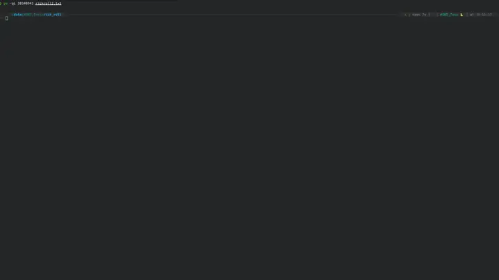

## ANSI 历史
早期的计算机都是一个计算的核心，连上数个可以输入和输出字符的终端。这些终端需要确定如何显示，包括左右对齐，CLI绘制等，此时计算机就会给出专门的控制符，即不可见控制符。主要经历了这三个时代：
### 电传打字机（TTY）与硬拷贝时代

- **物理限制驱动的设计：** ASR-33 等早期电传打字机基于机械敲击与纸张进给。控制字符的物理意义严格对应机械运动：
    
    - `\r` (CR, Carriage Return, `0x0D`)：驱动电机将打印头物理横移滑回最左端。
        
    - `\n` (LF, Line Feed, `0x0A`)：驱动滚轮将纸张向上推移一行。
        
    - **为什么是 CRLF：** 打印头复位需要机械惯性缓冲时间（约几毫秒到几十毫秒），如果紧跟普通字符会导致字符重叠打偏；因此必须在行尾先发送 CR，利用随后的 LF 延迟让打印头归位。
        
- **带外 vs 带内 信令：** 早期的通信链路无法为“控制命令”单独拉一根信号线，所有光标、颜色、蜂鸣必须复用数据通道。这种在一个字节流中同时传输“数据”与“控制指令”的机制，即**带内信令**。
    

### 视频终端（Glass TTY）的碎片化与痛点

- **厂商各自为政（1970 年代初）：** 阴极射线管取代纸张后，出现了 Datapoint 3300、Hazeltine 1500、Lear Siegler ADM-3A 等终端。
    
    - 早期没有统一规范，控制光标移动的字节序列由厂商随意定义。例如 Hazeltine 用 `~` 作为引导符，ADM-3A 用 `Ctrl+^` 定位。
        
    - **历史遗留细节：** ADM-3A 键盘上的 `H`、`J`、`K`、`L` 键帽上印有左、下、上、右箭头，Bill Joy 正是在该终端上开发了 `vi`，这塑造了延续至今的按键习惯。
        
- **软件分发的灾难：** 开发者写的文本排版程序无法跨终端运行，直接促成了终端能力数据库 `termcap`和后来的 `terminfo` / `ncurses` 的诞生。

### 标准化转折点：ECMA-48 与 DEC VT100

- **ANSI X3.64（后纳入 ISO/IEC 6429 / ECMA-48）：** 规定以 ASCII 的 `ESC`（`0x1B`）作为转义引导字符，后接 `[` 构成 **CSI（Control Sequence Introducer）**。
    
- **DEC VT100（1978 年）：**
    
    - 搭载 Intel 8080 微处理器的划时代硬件终端。
        
    - 全面实现了 ANSI X3.64 标准，支持硬件平滑滚动、反白显示、双倍宽/高字符。
        
    - VT100 凭借巨大出货量成为事实上的软硬件工业标准。现代所有终端模拟器（xterm、Alacritty、iTerm2、Windows Terminal）本质上都是在软件中模拟 VT100/VT220 的子集与扩展集。

## 终端解释过程

现在的计算机没有了当年的终端，也就是根据内核给出的控制信号来进行控制台绘制的硬件，但是我们完全可以通过软件来模拟当年的硬件，软件自己代替终端的字符解释和绘制，这也是现在的终端全名都叫“终端模拟器”的原因。

无论是什么形态的终端，它们的工作流程如下：

### 写入字节流
首先有一个对内核的输入，广义上它可以是用户的输入（缓冲区），可以是一个文件，可以是硬件随机数发生器，可以来自网络。这一点在Linux的“一切皆文件”哲学中很好理解。这些输入都会进入内核进行处理。用户态程序（如 `vim`、`ls`、`htop`）根据自己的界面排版需求，在代码里直接将 ANSI 控制字节与要显示的文本拼在一起。比如要在“第 2 行第 16 列输出红色文字”，程序就会主动向标准输出 `write` 写入 `\x1b[2;16H\x1b[31m文本\x1b[0m`。

> 有一个初学者常见的误区：为什么使用字符串拼接来传递控制符号，万一有人真的只是想传递一个`\033[31m` 字符串怎么办？ 
> 这里需要区分 **“代码中的表示法”** 与 **“网络/管道中的真实二进制”**： `\033` 只是人类在 C 语言或 Shell 里输入不可见字符的**字面量转义**。在底层的真实字节流里，它会被编码为单个二进制字节 `0x1B`（ASCII 中的 `ESC`）。
> 
> 例如真正会执行的在底层长这样：`0x1B (ESC) 0x5B ('[') 0x31 ('1') 0x6D ('m')` ，而如果我们要显示出来给人类看，表示的其实是： `0x5C ('\') 0x30 ('0') 0x33 ('3') 0x33 ('3') 0x5B ('[') 0x31 ('1') 0x6D ('m')`
> 这两个实际上就是`\033`表示了`ESC`这个不可见的操作符。`ESC`在底层为`0x1B`这个字节，终端只要收到了这个字节就会开始知道接下来是绘制指令而不是数据。
> **在文本源码层面**，程序员写反斜杠 `\033` 只是为了输入不可见字节，并不是真的传输了一堆字符 `\`、`0`、`3`、`3`。
> 如果有人尝试执行`echo '\033[31m'` ，此时没有任何操作符，全都是可以打印的内容，终端将按照原样输出。
> 如果想让终端进行转义操作，可以执行`echo -e '\033[31m'` ，Shell会去读取`\033`并将其查表得到操作符换进去，终端再拿到的时候就会执行了。
> 
> 这个思考也让我想到了乔布斯当年使用蓝盒子来偷打电话，就是因为控制和数据走了一样的信道并且使一种可能为数据的信号有了二义性；还有现在AI输出的`<think>`的token ，底层的词语向量并不是thinking加两个尖括号，而是一个特殊字符，只是使用 `<think>` 表示了。这个就是之前说的“带内指令”，很有意思，之后NCC单独出一次来讲。

### 终端模拟器核心
终端此时拿到的内容就很明了了，不断扫过去，遇到`0x1B`等控制符号就停下来切换为指令模式，根据后面的参数切换绘图指令。接收到可打印字符就正常输出。总的来说就是三个状态机互换：
- **Ground 状态：** 接收到 `0x20-0x7E` 或 UTF-8 编码字节时，直接将字形放入当前光标位置的单元格，光标递增。
    
- **Escape 状态：** 截断普通渲染，等待指令类型（如 `[` 代表 CSI，`]` 代表 OSC）。
    
- **CSI Param 状态：** 解析 ASCII 编码的十进制参数。例如 `\033[31;1m` 中的 `31` 和 `1`。

#### CSI 与 OSC 的语义差异

- **CSI (Control Sequence Introducer) - `\033[`：**
    
    - 作用范围：局限在文本缓冲区（Buffer）内。
        
    - 控制内容：光标位置、前景色/背景色、文本清除、滚动区域设置。
        
- **OSC (Operating System Command) - `\033]`：**
    
    - 作用范围：与终端宿主操作系统及窗口交互。
        
    - 控制内容：修改窗口标题（`\033]0;Title\007`）、系统剪贴板读写（OSC 52）、通知弹窗触发。

## 整活方向

### 只要读取就接管CLI显示的文本文件
利用 ANSI/OSC 序列，一个不包含任何可执行代码的普通 .txt 文件即可改变窗口标题、强行切屏并绘制伪造的交互界面。

因为`cat`指令会忠实地将文本文件中的内容逐个字节输出，就算是控制符也不例外。那些改变颜色，修改窗口标题，改变指针位置的控制符，全都会被终端执行。但是可以放心的是，它最大的影响是可能修改你的剪切板，可能把你的终端换成鬼画符字符，可能让你的终端全花了颜色乱了，但是这个时候盲打`reset`即可治好。

下图是做的查看就rickroll的样例：

### 只要连接上就会放字符动画的服务器
这其实是第一个的网络版本，因为网络栈很方便做这种单纯的字符同步内容，只需要把字符不断往外喷就好了。

## 引用
[将图像转化为命令行工具——Chafa](https://github.com/hpjansson/chafa)

[ANSI转义标识符对照表](https://gist.github.com/Bemly/25b4391d1c34c5e3d1fbb238634570b2)

此外还感谢 Gemini-3.8-Flash-Extend 对于历史的补充和关于CSI和OSC部分的讲解！